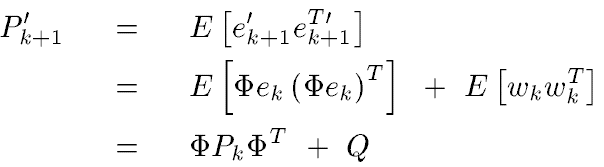

---

---

<h1 id="kalman-filter">Kalman Filter</h1>
<h2 id="introduction">1.  Introduction</h2>
<ul>
<li>
<h3 id="linear-kalman-filter-kf">Linear Kalman filter (KF)</h3>
<ul>
<li>
<h4 id="models-in-kalman-filter">Models in Kalman filter</h4>

In kalman filter, there are 3 kinds of models: noise model, process model and measurement model .

<ul>
<li>

Process model:

where 
<em>state vector x</em>: 
input vector x. x represents the states of the system you design (set of states) 
<em>state variable <em>: 
each variable inside x. Each state variable represents a state in the system(velocity, position) 
<em>trainsition matrix</em> : 
Transition matrix is the matrix transiting the states at k moment to states at k+1 moment. The transition matrix is dependent on the system you build. 
<em>noise term Wk</em>: 
usually the noise is in Gaussain noise 
For example:	 
we know velocity v_k= a * t_k at k moment.  In k+1 moment, v_k+1 = a</em> t_k+1. Then we have v_k+1 = v_k + a</em> (t_k+1 - t_k).  To represent v and a in matrix form: 
[v_k+1, a_k+1]^T  = [1, delta_t]* [v_k, a_k]^T 
[1, delta_t] is the transition matrix here

<ul>
<li>

Measurement model:

 
where 
<em>zk</em>: measurement vector obtained from sensors 
<em>H</em>: connection matrix between measurement vector z and the state vector x 
<em>vk</em>:  the noise from measurement

</li>
<li>

Noise model: 
in noise model, there are 3 covariance matrices to representing the information in the model 

</li>
</ul>
</li>
</ul>
<ul>
<li>
<h4 id="designing-a-kalman-filter">Designing a kalman filter</h4>
<ul>
<li>

The key idea of Kalman filter is to use maximium likehood method to minimize the error between the expected output signal and the measurement. In kalman filter, it defines <em>estimation</em>   and <em>prior estimation</em>  
Their relation is: 

where "Zk - HXk` " is called measurement residual. It is the error term between actual states and estimated states. In my prospective,   can be considered as the expected output states processed with noise term, which can have the ‘ability’ to ‘fight against’ the noise. Then it is used to predict the next output by transition matrix. 
What’s more, in the equation above, ‘Kk’ is called Kalman gain, which is used to control how the error term affects the estimation. Our goal is to calculate the kalman gain to predict the next output.

<ul>
<li>

<strong>To calculate kalman gain</strong> 
To find the Kalman gain, let think of maximum likehood. In , it’s actually calculating the covariance between measurement and expected value. When the probability is maximized, the error between measurement and the expected value is minimized and this is what we want. Therefore, we need to find a way to maximize the probability and return its arguments to update the Kalman gain. 
Now calculate the trace of the matrix Pk to get  T[Pk], which can convert the matrix to scalar value. 
Insert the equation   to  . We get: 
 
set the derivative of T[Pk] to zero (since at local maxima, derivative of T[Pk] =0) . Then we reach: 
 
 
Finally, we get Kalman gain:

</li>
<li>

<strong>Update estimate</strong> 
To update estimate, use the following equation (which was mentioned above):

</li>
<li>

<strong>Update Covariance</strong> 
To update the covariance matrix Pk, we need to plug the kalman gain equation back to

 
and then we get:

</li>
<li>

<strong>Project to k+1 moment</strong> 
After update the covariance matrix at k moment, we can use the covariance matrix equation to update prior covariance at k+1 moment:

</li>
</ul>
</li>
<li>

<strong>Summary of equations</strong> 

</li>
</ul>
</li>
</ul>
</li>
</ul>
</li>
<li>
<h3 id="extended-kalman-filter-ekf">Extended Kalman filter (EKF)</h3>

extended kalman filter is to model the non-linear system. The difference between EKF and linear KF shown as following: 

where: 
<em>F</em> is the transition matrix. 
<em>Bu</em> is the control input 
EKF uses derivative method to calcuate the transition matrix <strong>F</strong> and connection matrix <strong>H</strong> in order to update estimate <strong>Pk</strong> and Kalman gain. More details are introduced in 	<a href="https://drive.google.com/file/d/0By_SW19c1BfhSVFzNHc0SjduNzg/view">Kalman and Bayesian Filters in Python</a>

</li>
</ul>
<h2 id="flowchart">2. Flowchart</h2>

<h2 id="summary">3. Summary</h2>

In my opinion, Kalman filter is to use error minimization and maximum likehood method to minimize the error between actual measurement and estimated states. As the likehood is maximized, the error will get close to zero. It also applies the noise term in the estimate to ‘fight against’ the noise in measurement. 
Generally, There are 2 steps in Kalman filter : predict step and update step. In predict step, it computes the Kalman gain, estimate and covariance at k moment. In update step, it updates the prior estimate and the prior covariance for the next moment.

<h2 id="addition">4. Addition</h2>

Source code is <a href="./src">here</a>

<h2 id="reference">5. Reference</h2>

Referrence can be found <a href="http://web.mit.edu/kirtley/kirtley/binlustuff/literature/control/Kalman%20filter.pdf"> here</a> . 
Further reading: 
<a href="https://www.seas.harvard.edu/courses/cs281/papers/unscented.pdf">unscented kalman filter</a> 
<a href="http://www.cs.unc.edu/~tracker/media/pdf/SIGGRAPH2001_CoursePack_08.pdf">An introduction to the Kalman Filter</a> 
<a href="https://drive.google.com/file/d/0By_SW19c1BfhSVFzNHc0SjduNzg/view">Kalman and Bayesian Filters in Python</a>

<h2 id="addition-1">6. Addition</h2>

Since this is my first time to write theoretical note on GitHub, if you have any suggestions, please feel free to commit here.

<!--stackedit_data:
eyJoaXN0b3J5IjpbLTE3Mjk1NjU0MjddfQ==
-->